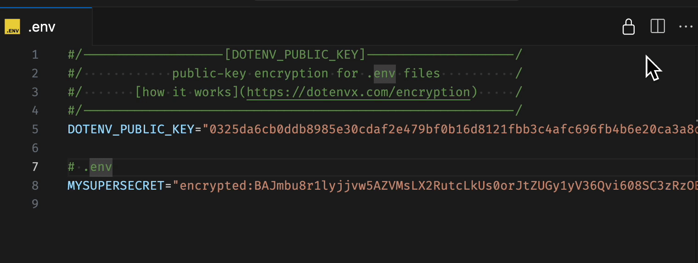

# dotenvx-decrypt-vscode

Dotenvx (work in progress) support for VS Code.

Currently supports

- [x] Reveal encrypted secrets inline
- [x] Open decrypted document in new tab
- [x] Check dotenvx version
- [x] Convert currently open dotenv

**Enjoy!**
